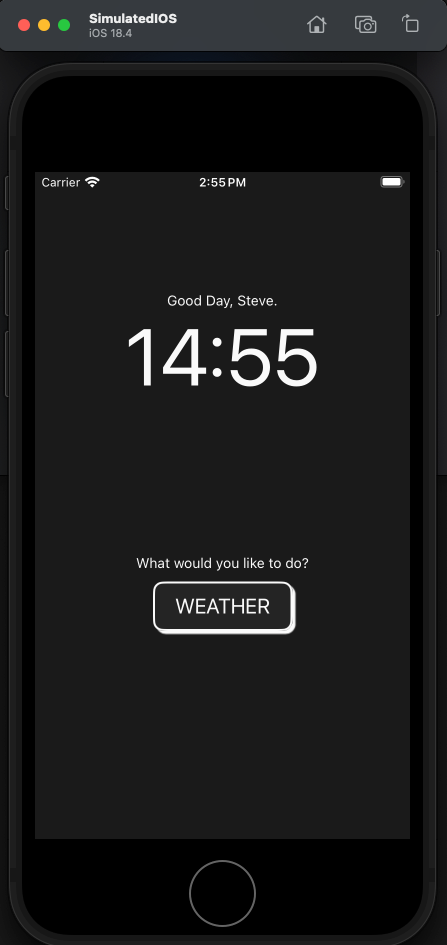
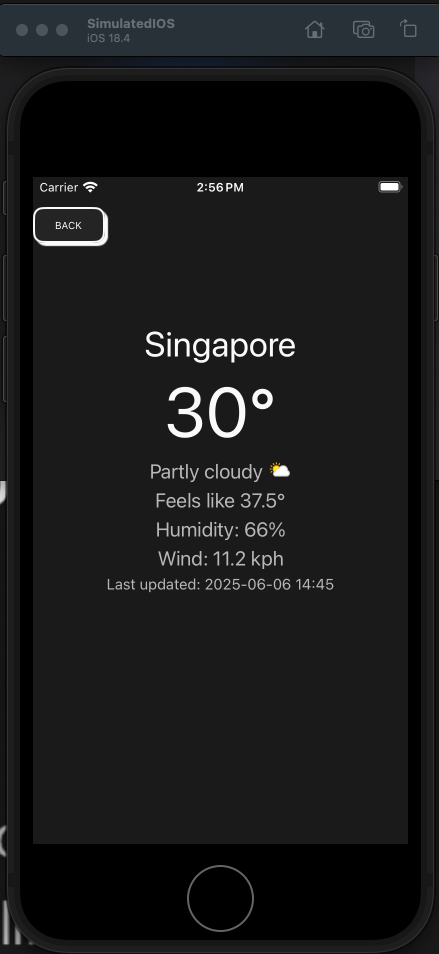

# Very simple Weather App

This project is done to try out Lynx Framework by ByteDance. Making use of the native component in Lynx to compose this app out. The weather data within this app is fetched from [WeatherApi](https://www.weatherapi.com/). An API key is required to fetch the data from the source.

rename `src/constant_copy.ts` to `constant.ts` and input your api key and country to see the weather data in the app.

## Screenshot of the app

### Home Screen


### Weather Screen


================================================================

## Rspeedy project

This is a ReactLynx project bootstrapped with `create-rspeedy`.

## Getting Started

First, install the dependencies:

```bash
npm install || pnpm install || bun install
```

Then, run the development server:

```bash
npm run dev || pnpm run dev || bun run dev
```

(Optional) To build the lynx app:

```bash
npm run build || pnpm run build || bun run build
```

(Require LynxExplorer App) To view the preview of this Lynx app:

```bash
npm run preview || pnpm run preview || bun run preview
```

Scan the QRCode in the terminal with your LynxExplorer App to see the result.

LynxExplorer is an app that serve as a sandbox for trying out Lynx project quickly. It is available on both IOS App Store and Google Play Store

You can start editing the page by modifying `src/App.tsx`. The page auto-updates as you edit the file.
